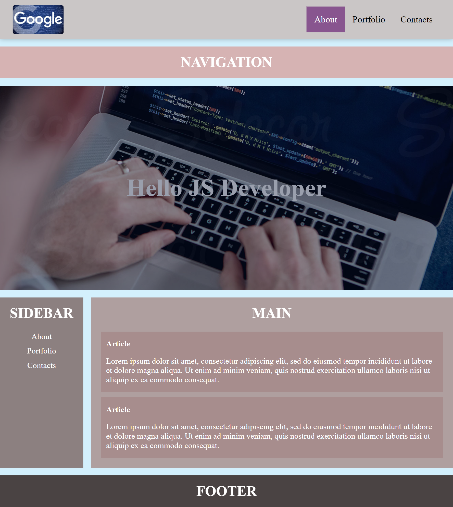
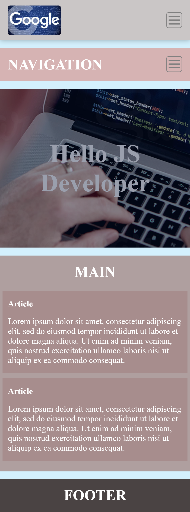

## General info

This project is simple schematic template of a site which was done during first lessons of learning front-end development.

## Technologies

Project is created with:

- Live Sass Compiler - version 3.0.0 (11.07.2018)

## Screenshots

Full size view:

Mobile view:

